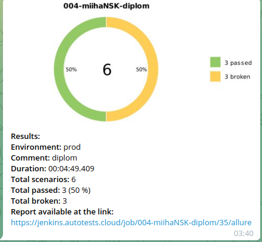

# Проект автотестов для https://kz.siberianwellness.com/kz-ru/

## UI + API  автотесты
* Тесты авторизации
    * ✅ Авторизация по номеру телефона UI
    * ✅ Авторизация по контракту UI
    * ✅ Ошибка авторизации - введен неверный пароль UI
    * ✅ Проверка схемы ответа авторизации API
* Тесты на работу с корзиной
    * ✅ Добавление товара в корзину без авторизации UI
    * ✅ Добавление товара в корзину авторизованного пользователя UI+API


## Применнные технологии
<p  align="center">
  <code></code>
  <code></code>
  <code></code>
  <code></code>
  <code></code>
  <code></code>
  <code></code>
  <code></code>
  <code></code>
  <code></code>
</p>


## Запуск тестов
### Локально
Склонировать проект. Через консоль в папке проекта выполнить команду:
```
pytest
```

### Удаленно
```bash
python -m venv .venv
source .venv/bin/activate
pip install poetry
poetry --version
poetry install --no-root
poetry update
pytest .

```

##  Запуск тестов из [Jenkins](https://jenkins.autotests.cloud/job/004-miihaNSK-diplom/)
Запуск тестов из Jenkins:
Добавить проект в Jenkins и нажать кнопку "Собрать сейчас".

<p></p>

Нажать на иконку Allure возле завершившегося процесса для просмотра отчета

<p></p>


###  [Allure](https://jenkins.autotests.cloud/job/qa_guru_python_4_25/allure/)

#### Примеры отчетов


###  Telegram

#### Настроена отправка отчета в Telegram



